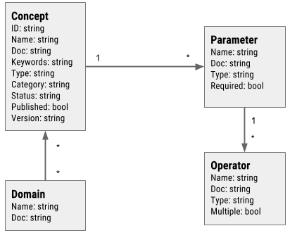

# Concept Registry

The concept registry service supports creating and managing concepts. Concepts are the core building blocks for how Harvest generalizes various bits of functionality including query and data retrieval. The logical data model is shown below.



## Development

Prerequisites:

- [Glide](https://glide.sh) - Download from the website or using Homebrew for OS X `brew install glide`.

### Setup

To perform the setup, run the following command. This can safely be run multiple times.

```
make setup
```

Other targets.

```
build       Create a one-off build of Harvest and write it to $GOPATH/bin
watch       Watch source files, rebuild after changes, and run the HTTP server.
test        Run all tests.
dist        Create distribution builds. Output is in the dist/ directory.
```
